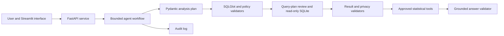
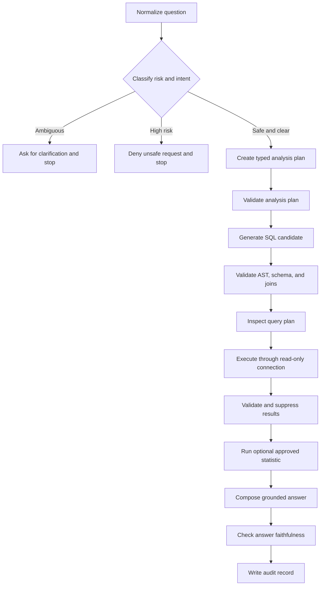
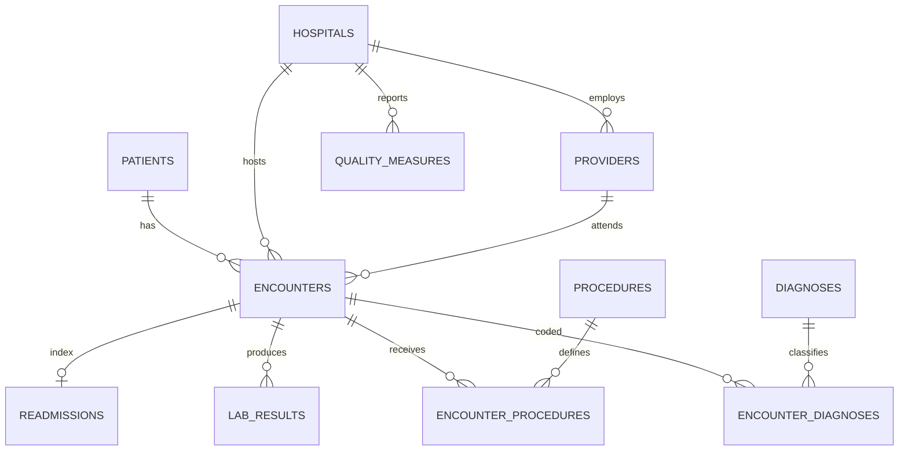

# Agentic Clinical SQL Analyst

[](#testing) [](#quick-start) [](LICENSE)

A portfolio-grade, constrained analytics agent that turns natural-language questions into typed analysis plans, validated read-only SQL, verified statistics, and evidence-grounded answers over an entirely synthetic healthcare database. It demonstrates relational design, practical SQL, agentic orchestration, FastAPI, Streamlit, statistical tooling, Docker, CI, auditability, and explainability—without requiring a paid service to launch.

> **Synthetic data only. Educational/portfolio software, not a clinical decision system.** No record represents a real patient, provider, or hospital.

## Screenshots

| Analysis workspace | Validation and audit |
|---|---|
|  |  |

## Why this exists

Text-to-SQL demos often give a model excessive authority and trust plausible-looking output. This project separates interpretation from authority. The agent can propose a registered metric and SQL candidate, but deterministic code decides whether the query may run, recomputes important quantities, suppresses small cells, and checks whether the answer is supported.

### Key features

- 12-table normalized SQLite model, foreign keys, checks, indexes, views, and reproducible synthetic data
- Credential-free deterministic agent supporting curated analytical questions against the real database
- Pydantic analysis plans before SQL; ambiguity such as “Which hospital is worst?” triggers clarification
- SQLGlot single-statement AST checks, table/column/function allowlists, join/resource controls, and row limits
- SQLite URI read-only mode, `query_only`, timeout progress handler, and `EXPLAIN QUERY PLAN`
- Registered healthcare metrics and fixed statistical tools; arbitrary generated Python never runs
- Result plausibility checks, deterministic arithmetic, small-cell suppression, grounded answer templates
- FastAPI/OpenAPI, polished Streamlit UI, JSON audit trail, benchmarks, pytest, Docker Compose, and CI
- 20 annotated reference queries covering joins, CTEs, subqueries, date logic, views, indexes, and windows

## What the safety-focused description means in plain English

The project description says that it uses a **bounded AI workflow with structured planning, SQLGlot validation, privacy controls, approved statistical tools, deterministic result checks, evidence-grounded answers, and complete audit trails**. Put simply, the AI is allowed to suggest an analysis, but it is not trusted with unrestricted control. Ordinary application code decides what is safe to run, checks the results, limits what may be shown, and records what happened.

### Bounded AI workflow

“Bounded” means the AI operates inside a fixed process with clear limits. It can interpret a question and propose how to answer it, but it cannot connect directly to the database, change the database, run arbitrary programs, or retry forever.

For example, the workflow follows steps such as:

1. Understand the user's question.
2. Decide whether the question is clear and safe.
3. Create a structured analysis plan.
4. Propose SQL.
5. Validate the SQL with ordinary code.
6. Inspect the database query plan.
7. Execute the query through a read-only connection.
8. Check and suppress the returned results where necessary.
9. Optionally run one approved statistical function.
10. Produce an answer based only on verified evidence.
11. Save an audit record.

If the question is unclear—such as “Which hospital is worst?”—the application asks what “worst” means. If a request is unsafe, such as asking for patient-level exports, it is denied. If validation fails, execution stops safely.

### Structured planning

The AI cannot jump directly from a user's question to database execution. It must first complete a structured analysis plan that identifies items such as:

- the metric being requested;
- the population or cohort to analyze;
- inclusion and exclusion rules;
- the date range;
- grouping and comparison fields;
- the required database tables;
- the minimum acceptable group size;
- whether a statistical test is needed; and
- whether the question is ambiguous or presents a privacy risk.

Pydantic checks that this plan has the required fields and valid data types. This is similar to requiring someone to complete a standardized request form before they are allowed to submit a database query.

### SQLGlot validation

SQLGlot turns proposed SQL into a structured syntax tree so the application can inspect what the query actually does. This is safer than searching the SQL text for suspicious words because the validator can identify the statement type, tables, columns, functions, and joins.

The validator rejects, among other things:

- attempts to insert, update, or delete data;
- attempts to create, alter, replace, or drop database objects;
- multiple SQL statements hidden in one request;
- access to SQLite system tables or administrative commands;
- tables or columns that do not exist in the approved schema;
- functions that are not on the allowlist;
- joins without meaningful matching conditions; and
- queries that exceed configured complexity or result-size limits.

Even SQL that passes these checks is executed through a separate read-only database connection. The SQL validator and database permissions therefore provide two independent layers of protection.

### Privacy controls

The application is designed to return summarized information rather than individual records. Although the included data is synthetic, the project models privacy practices that would matter when working with healthcare information.

- Aggregate counts, rates, and trends are the default.
- Patient-level output and unrestricted exports are denied.
- Requests involving sensitive demographic combinations are flagged.
- Groups with fewer than 10 observations are suppressed.
- Only a small, verified result sample is provided as context for follow-up questions.
- API keys and direct identifiers are not written to audit logs.

For example, the application may report a hospital's complication rate when enough eligible cases exist, but it will not provide a list of the patients behind that rate.

### Approved statistical tools

The AI cannot write and execute arbitrary Python. It may only select a statistical operation from a predefined registry of reviewed functions, including:

- proportion confidence intervals;
- chi-square tests;
- Fisher exact tests;
- independent-samples t-tests;
- Mann–Whitney U tests;
- one-way ANOVA; and
- Pearson or Spearman correlations.

These functions check their inputs, sample sizes, missing values, and assumptions before running. They return structured results and warnings. The AI chooses from the available tools, but the application—not the AI—owns and executes the underlying Python implementation.

### Deterministic result checks

“Deterministic” means the same input is checked using explicit programming rules rather than model judgment. After a SQL query runs, ordinary Python code verifies conditions such as:

- denominators must be positive;
- counts cannot be negative;
- a numerator cannot exceed its denominator;
- rates must remain between 0 and 1;
- percentages must remain between 0 and 100;
- empty results must be reported clearly;
- suspicious values should produce warnings; and
- small groups must remain suppressed.

Important arithmetic is calculated from verified database values. The application does not ask the language model to perform or guess the final calculations.

### Evidence-grounded answers

The final answer is limited to information found in the validated plan, executed SQL, verified result table, approved statistical output, and recorded warnings. Names, categories, sample sizes, percentages, rankings, and comparisons must come from that evidence.

If the query returns no evidence—or if the evidence does not support a conclusion—the application should say so. It should not fill gaps with plausible-sounding medical or operational claims.

### Complete audit trails

Every analysis receives a unique run ID. The audit record stores information needed to reconstruct how the answer was produced, including:

- the original and normalized question;
- the selected model and schema version;
- the structured analysis plan;
- the generated and validated SQL;
- validation and execution status;
- execution time and returned row count;
- approved statistical tools used;
- warnings and limitations;
- the final grounded answer; and
- the creation timestamp.

Secrets such as OpenAI API keys are deliberately excluded. The audit trail makes the system easier to debug, test, explain, and review without exposing credentials.

### The division of responsibility

| The AI may | Deterministic application code must |
|---|---|
| Interpret the user's wording | Classify privacy risk and enforce policy |
| Identify ambiguity | Validate the structured plan |
| Select a registered metric | Control the metric definitions |
| Propose one SQL query | Parse, allowlist, limit, and approve the SQL |
| Request an approved statistical tool | Validate inputs and execute the fixed function |
| Draft an interpretation | Check values and ground claims in verified evidence |

The central idea is straightforward: **the AI proposes; deterministic software verifies and controls**.

## Architecture







Safeguards stack from outside inward: **privacy classification → typed plan → metric registry → AST/schema/join allowlists → plan inspection/resource caps → read-only database → result checks/suppression → fixed statistics → answer faithfulness → immutable provenance record**.

## Database and SQL

`patients`, `hospitals`, `providers`, and `encounters` form the core. Diagnoses and procedures use normalized vocabularies with many-to-many bridge tables. Labs, readmissions, quarterly quality measures, and audits are separate facts. The seeded full profile creates approximately 25,000 patients, 30 hospitals, 200 providers, and 100,000 encounters. Hospital risk, diagnosis, age proxy, rurality, seasonality, and temporal trends generate useful analytical variation. Controlled missingness, suspicious dates, rare categories, inconsistent codes, and small cohorts support quality tests.

The [reference curriculum](sql/reference_queries/README.md) visibly demonstrates `SELECT`, filtering, sorting, grouping, `HAVING`, inner/left joins, CTEs, subqueries, `CASE`, dates, aggregates, `ROW_NUMBER`, `RANK`, `DENSE_RANK`, `LAG`, rolling windows, views, parameterization, indexes, and `EXPLAIN QUERY PLAN`. Database construction uses an explicit transaction.

## What is agentic—and what is not

The workflow observes state, selects a bounded path, can request clarification, chooses a registered metric/tool, and records structured actions. It is not fully autonomous: retry limits are finite (two SQL repairs, one result repair, one evidence-only answer rewrite as extension contracts), high-risk requests terminate, and deterministic components retain execution authority. The trace shows decisions, validators, tool calls, warnings, and retry reasons—not hidden chain-of-thought.

The LLM does **not** directly execute unrestricted SQL. Generated SQL is parsed before execution; the database handle is read-only. The model cannot redefine metrics, calculate final rates, run arbitrary Python, expose small groups, or add claims absent from verified evidence. Model self-critique is secondary because a model can confidently repeat its own mistake.

The baseline demo is intentionally deterministic. When a session-only API key is supplied, non-demo questions use the OpenAI Responses API with Pydantic Structured Outputs to propose an `AnalysisPlan` and one SQL candidate. That candidate passes through exactly the same non-bypassable deterministic pipeline; OpenAI never receives a database connection and the API key is never logged. Curated questions remain deterministic for reproducible demonstrations.

## Metrics, privacy, statistics, and provenance

The registry fixes numerator, denominator, eligibility, sample size, unit, grouping, null handling, and caveats for readmission, mortality, complications, length of stay, emergency conversion, cost, volume, and prevalence. Rates are checked and important ratios are computed from numerator/denominator output.

Aggregate results are the default. Direct identifiers and patient-level exports are high risk and denied. Sensitive demographic combinations are medium risk, explicitly warned, and groups under 10 are suppressed. Only the minimum result fields needed for an answer should reach a live model.

Approved tools include Wilson proportion intervals, chi-square, Fisher exact, Welch t-test, Mann–Whitney U, one-way ANOVA, and Pearson/Spearman correlations. Each validates types/sample size and returns structured estimates, effects, assumptions, and warnings. Regression and standardization are documented extension points in this MVP.

Every run receives an ID and records question, normalized intent, model label, schema version, plan, SQL, validation/execution status, timing, row count, statistical tool, warnings, answer, and timestamp. API keys are excluded.

## Example

Question: “Which hospitals had the highest 30-day readmission rates for heart failure in 2025?”

```sql
WITH cohort AS (... validated eligibility joins ...)
SELECT hospital_name, COUNT(*) AS denominator,
       SUM(readmitted_within_30_days) AS numerator,
       1.0 * SUM(readmitted_within_30_days) / COUNT(*) AS readmission_rate
FROM cohort JOIN hospitals USING (hospital_id)
GROUP BY hospital_id, hospital_name
HAVING COUNT(*) >= 10
ORDER BY readmission_rate DESC;
```

Output includes the direct answer, verified table/chart, sample size, fixed metric definition, caveats, exact validated SQL, referenced tables/columns, optional test result, trace, query-plan provenance, and audit ID. If evidence is empty or inconclusive, the answer says so.

## Quick start

```bash
python -m venv .venv
# Windows: .venv\Scripts\activate
# macOS/Linux: source .venv/bin/activate
python -m pip install -e ".[dev]"
python -m src.database.seed --patients 2500 --encounters 10000
uvicorn src.api.main:app --reload
```

Open [http://localhost:8000/docs](http://localhost:8000/docs). In another terminal:

```bash
streamlit run app.py
```

Open [http://localhost:8501](http://localhost:8501). No key is required. For the full dataset, run `python -m src.database.seed` (100,000 encounters). Configuration lives in [.env.example](.env.example); never commit `.env`.

### Testing and benchmark

```bash
python -m pytest
python -m src.cli benchmark
```

The seed benchmark spans aggregation, joins, rates, cohorts, ambiguity, privacy denial, statistics, and prompt injection. It reports executable SQL rate, exact table selection, clarification/denial accuracy, and latency. See [evaluation design](docs/evaluation.md). Benchmark results are intentionally a placeholder until run in CI against a pinned release artifact.

### Docker

```bash
docker compose up --build
```

API: port 8000; UI: port 8501; generated data uses a named volume.

## API

| Method | Path | Purpose |
|---|---|---|
| GET | `/`, `/health` | metadata and readiness |
| GET | `/schema`, `/metrics` | allowlisted schema and registry |
| POST | `/analyze` | execute the bounded workflow |
| POST | `/validate-sql` | validate without execution |
| GET | `/runs`, `/runs/{run_id}` | audit provenance |
| GET | `/reference-queries` | curriculum discovery |
| POST | `/demo/reset` | safely refuses destructive HTTP reset |

Full contracts are in OpenAPI and [docs/api.md](docs/api.md).

## Project map

`src/agent` owns typed orchestration and planner adapters; `src/safety` deterministic policy; `src/database` engine-neutral catalog/execution contracts, the SQLite backend, and synthetic-data lifecycle seams; `src/metrics` immutable definitions; `src/statistics` fixed tools; `src/audit` the audit-store contract and SQLite provenance; `src/api` FastAPI; `src/ui` Streamlit; `src/evaluation` benchmarks; `sql` schema/views/indexes/reference queries; `tests` regression and compatibility coverage; `docs` design detail and ADRs. See the [distributed platform foundation](docs/platform_foundation.md).

## Design decisions, limits, and production hardening

SQLite makes the demo portable and inspectable; PostgreSQL should use a dedicated SELECT-only role and statement timeout. Curated SQL makes credential-free behavior reproducible. SQLGlot provides structural checks that regex cannot, though policy remains conservative. FastAPI supplies typed service contracts while Streamlit optimizes portfolio exploration.

Known limits: live planning requires network access, API credit, and access to the configured OpenAI model; relationship validation is conservative; statistics are unadjusted; no causal or clinical inference is intended; benchmark breadth should grow beyond the seed fixture; logistic/linear regression and standardized rates remain registry extensions; SQLite timeouts are cooperative; audit rows are not cryptographically tamper-evident. Production requires identity, authorization, encrypted/tamper-evident audit storage, migrations, PostgreSQL permissions/RLS, monitoring, reviewed metric governance, model/version pinning, red-team evaluation, approval queues, and incident response.

## Resume-ready description

**Agentic Clinical SQL Analyst: Designed a normalized healthcare database and a constrained LangGraph agent that converts natural-language questions into validated read-only SQL, executes multi-table analytics, invokes approved statistical tools, checks result plausibility, repairs failed queries, enforces privacy safeguards, and returns evidence-grounded findings with query provenance and audit trails.**

## Design rationale and technical walkthrough

### Relational database design

The schema is normalized so that each major concept has one authoritative home. Patient attributes belong in `patients`, facility attributes in `hospitals`, provider attributes in `providers`, and visit-level facts in `encounters`. Diagnosis and procedure definitions are stored separately from encounters so the same code and description do not have to be copied into thousands of rows.

An encounter can have multiple diagnoses and procedures, while each diagnosis or procedure can appear in many encounters. The `encounter_diagnoses` and `encounter_procedures` bridge tables model these many-to-many relationships without duplicating either side. Foreign keys prevent bridge records from referring to nonexistent encounters or vocabulary entries. `CHECK` constraints keep flags, categories, counts, costs, and rates within valid ranges, while unique and composite-key constraints prevent logically duplicate relationships.

Indexes are placed on common date filters and join paths, such as encounter admission dates, hospital IDs, patient IDs, diagnosis links, and readmission index encounters. They reduce the amount of data SQLite must scan for common analytical queries. Views such as `encounter_facts` and `hospital_readmission_summary` package frequently reused joins and calculations behind stable, readable interfaces.

Cohort queries explicitly distinguish a primary diagnosis from a secondary or comorbid diagnosis. For example, a heart-failure readmission cohort should not silently include every encounter where heart failure appeared anywhere in the diagnosis list. Requiring `primary_diagnosis_flag = 1` makes the population definition visible, reproducible, and less vulnerable to accidental double counting.

### SQL techniques demonstrated by the project

The annotated files in [`sql/reference_queries`](sql/reference_queries/README.md) progress from basic reporting to cohort construction and longitudinal analysis. Joins connect normalized entities; common table expressions break complicated cohort logic into named stages; and date calculations derive calendar periods, follow-up windows, and length of stay.

`HAVING` applies eligibility rules after aggregation, such as excluding hospitals with fewer than 30 cases. Window functions preserve row-level or period-level detail while adding comparisons across rows. `ROW_NUMBER` selects the latest encounter, `RANK` and `DENSE_RANK` create ordered comparisons, `LAG` compares a quarter with its predecessor, and framed `AVG` expressions calculate rolling averages. The examples also cover subqueries, `CASE`, left joins, parameterized filters, views, indexes, and `EXPLAIN QUERY PLAN`.

### Natural language to SQL as constrained compilation

The application does not treat text-to-SQL as “ask a model for code and run it.” It behaves more like a constrained compiler. First, the user's language is converted into a typed analysis plan containing the metric, population, dates, grouping fields, required tables, privacy tier, and expected output. The model may then propose one SQL candidate that implements that plan.

The candidate is only an untrusted intermediate representation. Deterministic validators decide whether it conforms to the registered metric, approved schema, relationship rules, privacy policy, and resource limits. Only an approved query reaches the read-only executor. This separation lets the model handle linguistic ambiguity without giving it authority over execution.

### Why SQLGlot is used

SQLGlot parses SQL into an abstract syntax tree (AST). The application can therefore inspect the actual statement type and its table references, column references, joins, functions, nesting, selected expressions, and limit clauses. It can also safely rewrite a query to insert a result limit.

Regular expressions are useful for supplemental checks such as detecting comments or obvious administrative keywords, but they do not understand SQL structure, aliases, nested queries, or common table expressions. AST validation is the primary control because it evaluates the parsed meaning of the query rather than relying only on surface text.

### Permissions and resource containment

Validation code can contain defects, so it is not the only boundary. Approved queries run through a SQLite URI connection opened in read-only mode with `query_only` enabled. Even if a future validator bug allowed a write statement through, the database connection would independently refuse the mutation.

Read-only permissions protect data integrity, but a valid `SELECT` can still consume excessive resources. The executor therefore adds row limits, caps query complexity, restricts joins and selected columns, reviews `EXPLAIN QUERY PLAN`, and installs a cooperative timeout. These controls reduce the risk of accidental Cartesian products, result explosions, and expensive scans.

### Why model self-critique is not enough

Asking a model to review its own SQL can improve quality, but it cannot serve as the sole safeguard. Generation and self-review are probabilistic and often share the same assumptions, so a model may confidently approve the same mistake it originally made.

This project keeps permission decisions, metric arithmetic, privacy suppression, and plausibility checks in deterministic code. Model-assisted criticism can be added as a secondary signal, but it cannot override the schema allowlist, read-only connection, fixed metric definitions, or result validators.

### Division of responsibilities

The LLM handles tasks that benefit from language understanding: interpreting the question, detecting ambiguity, selecting a registered metric, producing a structured plan, and proposing a SQL candidate. It may also draft an interpretation from the verified evidence.

Application code retains responsibilities that require predictable enforcement: deciding whether a request is permitted, validating the plan and SQL, controlling database access, performing arithmetic, executing approved statistics, suppressing small cells, checking result plausibility, grounding numeric claims, and writing the audit record. The model proposes; the software authorizes and verifies.

### Statistical reasoning and limitations

Statistical tests are selected according to the question and data shape. Proportion comparisons may use chi-square or Fisher exact tests; continuous two-group comparisons may use a Welch t-test or Mann–Whitney U test; several continuous groups may use ANOVA; and association questions may use Pearson or Spearman correlation. Confidence intervals communicate estimation uncertainty instead of reducing every analysis to a p-value.

Each fixed tool checks data types, minimum sample sizes, missing values, and relevant assumptions. Its output includes warnings and, where appropriate, an effect size or confidence interval. Statistical significance alone does not establish clinical importance or causation. The demo analyses are unadjusted, so apparent differences may reflect age, diagnosis mix, illness severity, hospital size, or other confounders rather than the grouping variable itself.

### Privacy, bounded behavior, and provenance

Small-cell suppression hides calculated values for groups with fewer than 10 observations. High-risk requests for patient-level records or unrestricted exports are denied. Medium-risk demographic analyses are flagged, and follow-up context contains only bounded samples of previously verified aggregate results. These data-minimization rules reduce unnecessary disclosure even though the included dataset is synthetic.

The workflow also has explicit stopping conditions. Ambiguous questions request clarification, validation failures stop execution, and repair paths have finite retry budgets. Every run receives an ID and records its question, typed plan, SQL, validation events, execution status, timing, row count, statistical tools, warnings, answer, and provenance. This structured history makes a result reproducible and reviewable without exposing API keys or hidden reasoning.

### Why the project uses both FastAPI and Streamlit

FastAPI exposes typed, reusable service contracts for analysis, SQL validation, schema discovery, metrics, reference queries, and audit runs. Automatic OpenAPI documentation makes those contracts easy to inspect and allows another frontend or service to use the same backend behavior.

Streamlit provides the interactive portfolio interface. It places the answer, verified result table, chart, metric definition, SQL, validator output, audit trace, schema, and dataset guide in one browser experience. This makes the system's evidence and safety boundaries visible instead of hiding them behind a conversational response.

### Reproducibility and continuous integration

Docker packages the Python runtime, dependencies, source code, and startup commands into a reproducible environment. Docker Compose starts the API and UI together while using a shared volume for generated synthetic data. A reviewer can therefore run the project without manually recreating the local development setup.

GitHub Actions installs the project in a clean Python environment, generates a deterministic test database, runs the pytest suite with coverage reporting, and smoke-runs the benchmark workflow. The pipeline checks that a fresh clone can reproduce the database, import the services, enforce the safeguards, and complete representative analyses.

## Security and clinical disclaimer

This is a defense-in-depth educational prototype, not a security certification. It uses synthetic data only and must not receive PHI. It is not validated for patient care, diagnosis, treatment, operational decisions, regulatory reporting, or hospital comparison. Review SQL, metrics, and outputs with qualified domain experts.

MIT licensed. Contributions are welcome under [CONTRIBUTING.md](CONTRIBUTING.md).
