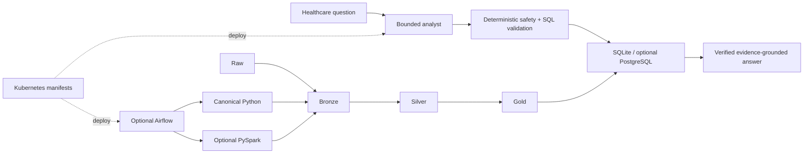
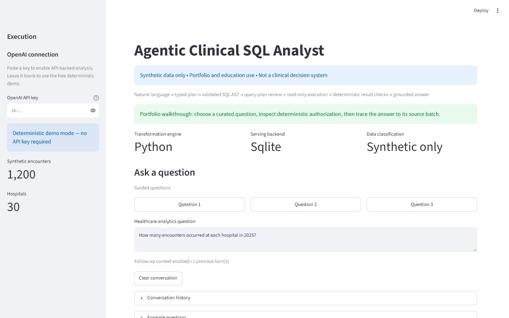

# Agentic Healthcare Data Platform

[](https://github.com/vdeeplearning/agentic_healthcare_data_platform/actions/workflows/ci.yml)


A governed healthcare analytics platform that turns natural-language questions into typed plans, validated read-only SQL, verified results, and evidence-grounded answers. It demonstrates how to combine an AI proposal layer with deterministic authorization, lakehouse processing, orchestration, deployment manifests, audit, and lineage—without giving a model permission to execute arbitrary code or redefine analytical policy.

> Synthetic data only. Portfolio and educational use only. Not a clinical decision system.



Plain English: the model can propose an analysis, but deterministic software decides whether it is safe, valid, bounded, executable, and supported by the returned evidence.

## 60-second overview

- Ask a curated healthcare analytics question in Streamlit or FastAPI.
- The analyst produces a typed plan and one bounded SQL candidate.
- SQLGlot-based policy checks statement type, schema, joins, functions, complexity, and limits.
- Approved SQL runs through a read-only backend with time and row bounds.
- Deterministic checks validate results and ground the final answer.
- Audit and lineage connect the answer to its serving snapshot and lake ancestry.
- A versioned raw/bronze/silver/gold pipeline runs with canonical Python or optional PySpark.
- Optional Airflow coordinates existing stages; Kubernetes YAML deploys existing services.



## Capability status

“Live verified” means the real runtime executed in the current verification environment—not merely that code exists or mocks passed.

| Capability | Implemented | Automated tests | Live runtime verified | Notes |
|---|:---:|:---:|:---:|---|
| SQLite serving | Yes | Yes | Yes | Default and compatibility backend |
| PostgreSQL serving | Yes | Unit/contract tests | Pending environment | Requires a live PostgreSQL DSN |
| Python transformations | Yes | Yes | Yes | Canonical raw → bronze → silver → gold engine |
| PySpark transformations | Yes | Contract/parity tests | Pending environment | Java/PySpark runtime unavailable locally |
| Airflow orchestration | Yes | Runtime-independent DAG tests | Pending environment | Native scheduler package unavailable locally |
| Kubernetes deployment | Yes | YAML consistency tests | Pending environment | Kustomize renders; no local cluster configured |
| FastAPI | Yes | Yes | Yes | Typed API with `/health` and OpenAPI docs |
| Streamlit | Yes | Yes | Yes | Normal and optional portfolio walkthrough modes |
| Audit and lineage | Yes | Yes | Yes | Answer → serving → gold → silver → bronze → raw |
| GitHub Actions | Yes | Repository workflow | See CI badge | Clean Python 3.11 workflow |
| Docker Compose | Yes | Configuration validation | Pending daemon | Docker daemon unavailable locally |

See [verification status](docs/verification_status.md) for exact distinctions and limitations.

## One-command local demo

The demo uses only the locally proven path: Python transformations, local filesystem lake, SQLite, FastAPI, Streamlit, and deterministic curated questions. No paid API key is required.

Windows PowerShell:

```powershell
.\scripts\demo.ps1
```

macOS/Linux:

```bash
./scripts/demo.sh
```

The scripts create or reuse `.venv`, install the base project, build and verify the lake pipeline, publish SQLite, launch both services, and print:

- UI: `http://127.0.0.1:8501`
- API docs: `http://127.0.0.1:8000/docs`
- clean shutdown instructions and suggested questions

Noninteractive smoke test:

```bash
python -m scripts.demo --smoke
```

Reset only generated portfolio-demo data:

```powershell
.\scripts\reset_demo.ps1
```

```bash
./scripts/reset_demo.sh
```

## Why this project matters

This project connects disciplines that are often demonstrated separately. The bounded analyst shows AI systems engineering and safety controls. The normalized schema, read-only execution, and SQL validation show relational design. The medallion lake, snapshots, manifests, and Python/Spark parity show data engineering. Airflow demonstrates workflow coordination without absorbing business logic. Kubernetes manifests demonstrate deployment operations without changing application contracts. Audit, lineage, testing, and CI make every claim reviewable rather than relying on a polished happy-path screen.

## Demo video

The complete 3–5 minute recording package includes [the production guide](docs/video_demo.md), [storyboard](docs/video_storyboard.md), [exact narration](docs/video_script.md), and [capture checklist](docs/video_capture_checklist.md). A short README preview plan is included in [the demo guide](docs/demo.md#short-gif-or-mp4-preview).

## Documentation

| Start here | Deep dive |
|---|---|
| [Platform overview](docs/overview.md) | [Architecture and diagrams](docs/architecture.md) |
| [Local demo and screenshots](docs/demo.md) | [Agent safety](docs/agent_safety.md) |
| [Verification status](docs/verification_status.md) | [Data model](docs/data_model.md) |
| [Testing](docs/testing.md) | [Data lake](docs/data_lake.md) |
| [Troubleshooting](docs/troubleshooting.md) | [Spark](docs/spark.md) |
| [Release notes](docs/release_notes_v1.md) | [Airflow](docs/airflow.md) |
| [Resume bullets](docs/resume_bullets.md) | [Kubernetes](docs/kubernetes.md) |
| [Interview talking points](docs/interview_talking_points.md) | [PostgreSQL](docs/postgres.md) |
| [Video package](docs/video_demo.md) | [Audit and lineage](docs/lineage.md) |
| [ADRs](docs/adr/) | [Operations](docs/operations.md) |

## Current limitations

- Only synthetic data is supported; this is not validated for PHI or patient care.
- Relationship metadata is descriptive; stricter join-key enforcement remains a reviewed future change.
- PostgreSQL, real PySpark, native Airflow, Docker image execution, and live Kubernetes deployment depend on unavailable local runtimes and are not claimed as live-verified.
- Local filesystem and SQLite paths are transparent and testable but are not multi-node production storage.
- Kubernetes manifests intentionally omit Helm, cloud resources, service mesh, and observability stacks.

## Release and license

See [CHANGELOG.md](CHANGELOG.md) and [v1 release notes](docs/release_notes_v1.md). MIT licensed; contributions are welcome under [CONTRIBUTING.md](CONTRIBUTING.md).
