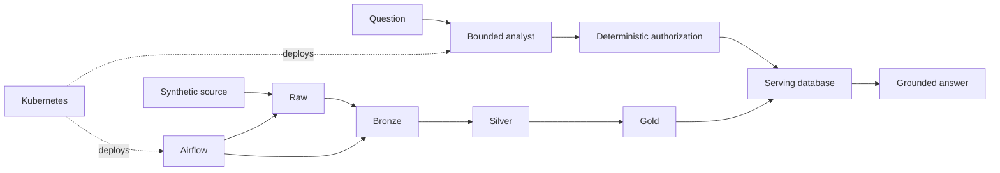
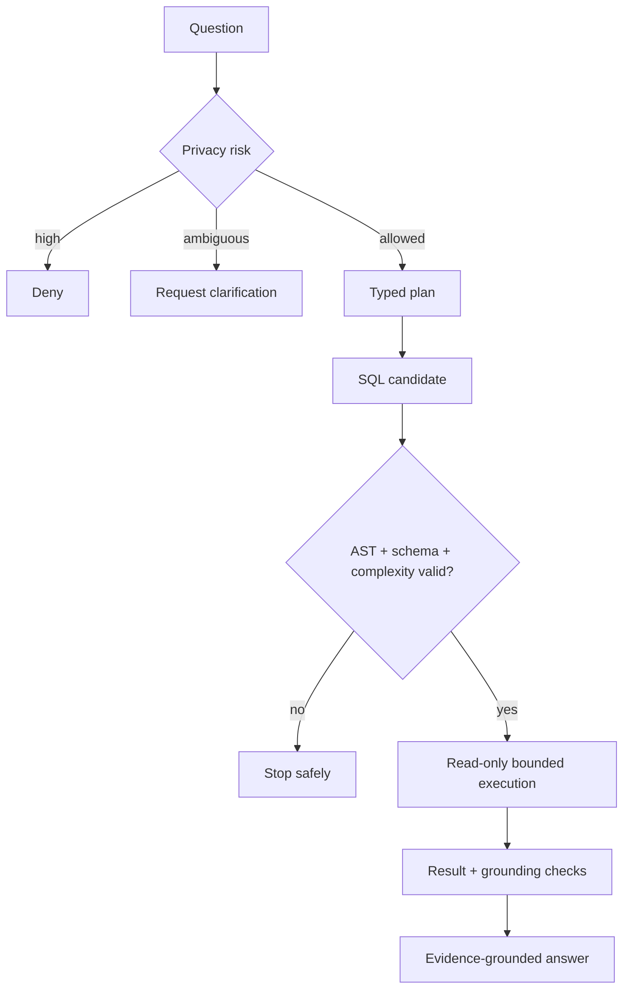
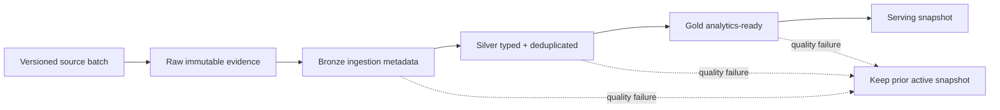
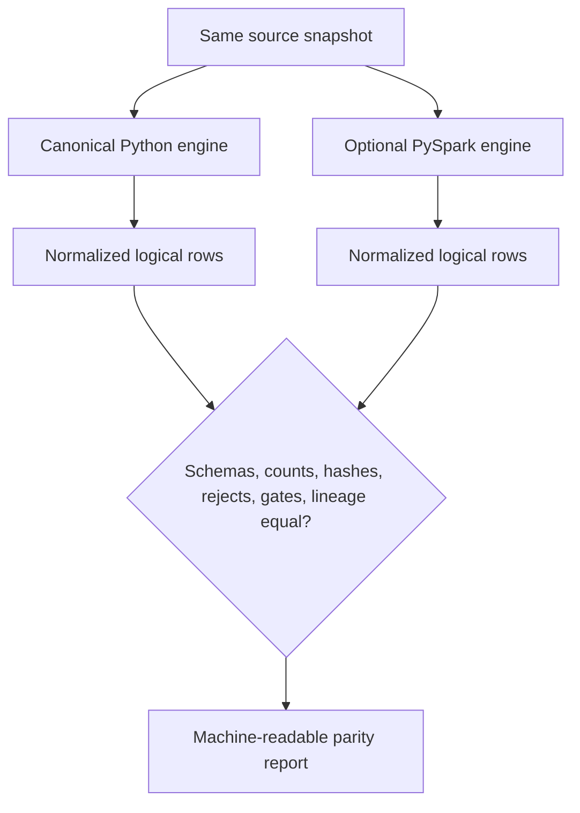
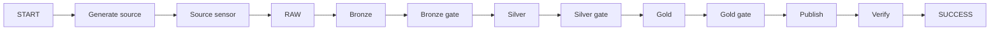
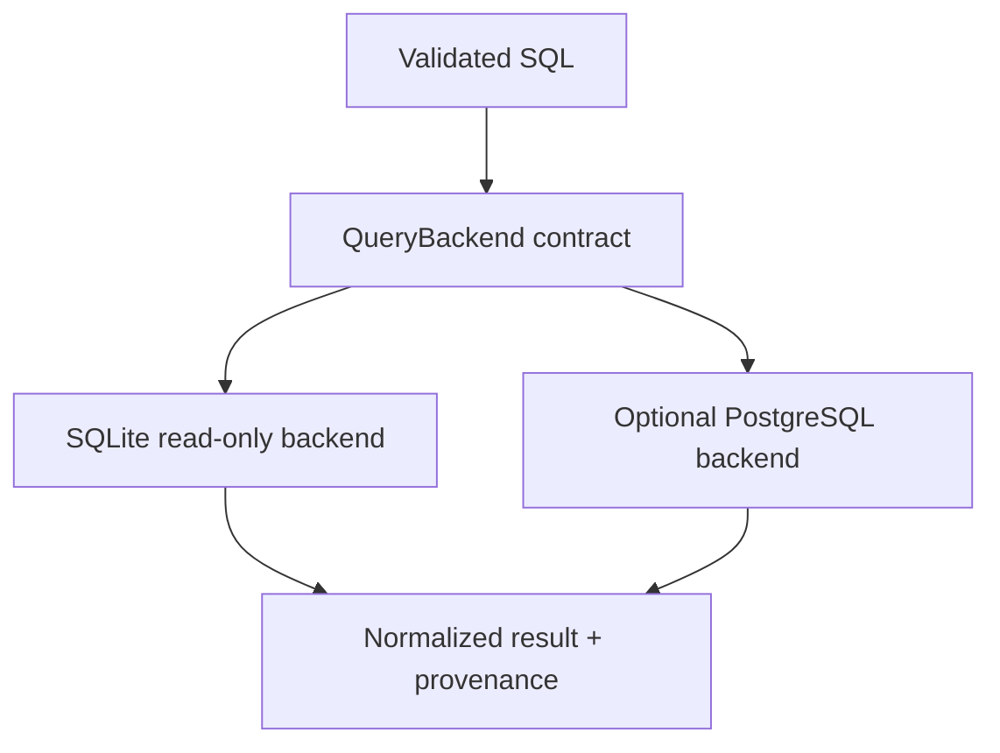
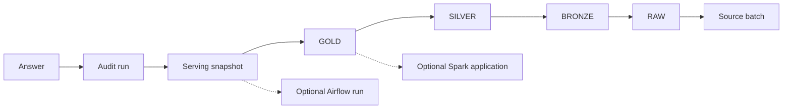
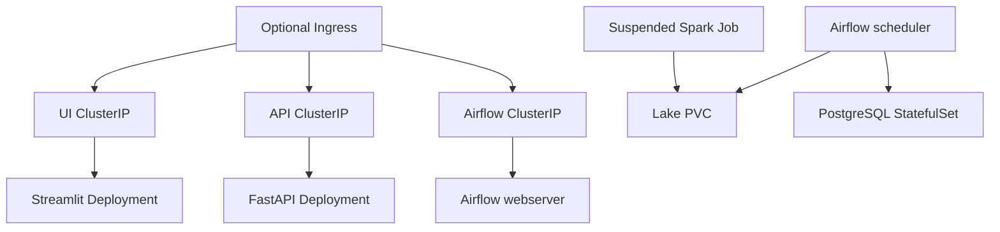
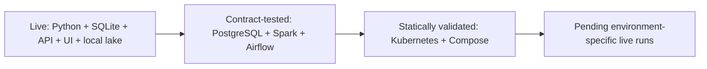
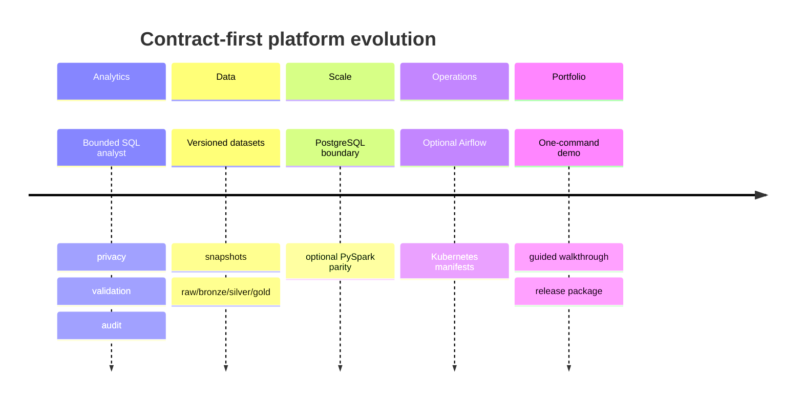

# Architecture and diagrams

Each diagram has a short summary for readers who do not use Mermaid rendering.

## 1. Executive end-to-end architecture

The analyst authorizes read-only analytics over governed serving data; lake processing, orchestration, and deployment remain separate layers.

## 2. Agent safety and authorization flow

The model proposes; deterministic policy can deny, clarify, or authorize bounded execution.

## 3. Medallion pipeline

Every transition publishes only validated candidates and preserves the previous active snapshot on failure.

## 4. Python and PySpark parity

Two physical engines implement one logical contract and compare normalized outputs.

## 5. Airflow DAG

Airflow coordinates existing stage functions; it contains no transformation or policy logic.

## 6. Serving backend abstraction

One validated-query contract supports default SQLite and optional PostgreSQL without moving authorization into a driver.

## 7. Audit and lineage

An answer resolves through immutable platform metadata back to its source batch.

## 8. Kubernetes topology

Kubernetes deploys the existing services with internal networking and persistent claims.

## 9. Verification boundary

Green local paths executed; optional external runtimes stop at contract or static validation in this environment.

## 10. Project evolution

Each milestone established contracts before adding a larger runtime.

