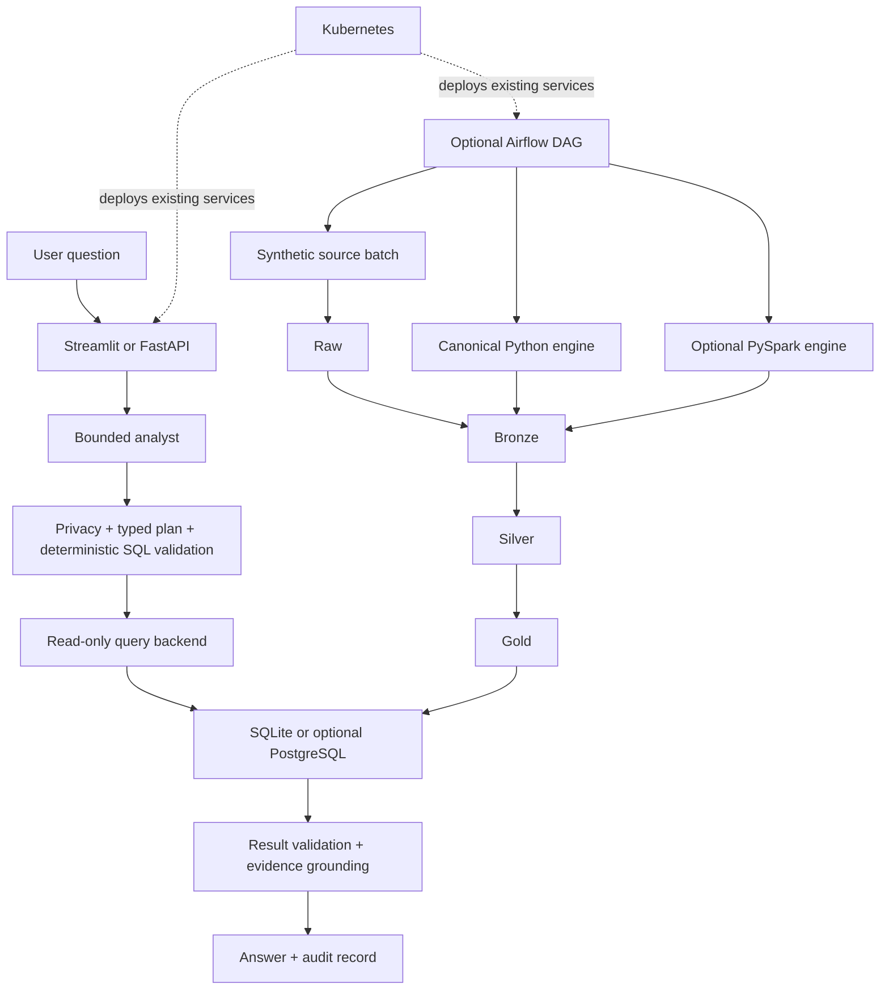

# Agentic Healthcare Data Platform manual

This manual is the comprehensive instruction and explanation reference for the repository. It explains what each component does, why it exists, how the pieces interact, how to run them, and which capabilities have actually been executed in the current verification environment.

> All included healthcare data is synthetic. This project is for engineering demonstration and education, not patient care, diagnosis, treatment, regulatory reporting, or real clinical operations.

## Contents

1. [Platform purpose](#1-platform-purpose)
2. [System architecture](#2-system-architecture)
3. [Quick start](#3-quick-start)
4. [Agentic analytics workflow](#4-agentic-analytics-workflow)
5. [Safety, privacy, and SQL authorization](#5-safety-privacy-and-sql-authorization)
6. [Healthcare relational data model](#6-healthcare-relational-data-model)
7. [Datasets, manifests, snapshots, and lineage](#7-datasets-manifests-snapshots-and-lineage)
8. [Raw, bronze, silver, and gold lake](#8-raw-bronze-silver-and-gold-lake)
9. [Canonical Python transformation engine](#9-canonical-python-transformation-engine)
10. [Optional PySpark transformation engine](#10-optional-pyspark-transformation-engine)
11. [Serving databases: SQLite and PostgreSQL](#11-serving-databases-sqlite-and-postgresql)
12. [Apache Airflow orchestration](#12-apache-airflow-orchestration)
13. [FastAPI service](#13-fastapi-service)
14. [Streamlit user interface](#14-streamlit-user-interface)
15. [Docker and Docker Compose](#15-docker-and-docker-compose)
16. [Kubernetes deployment](#16-kubernetes-deployment)
17. [Configuration reference](#17-configuration-reference)
18. [Audit and end-to-end lineage](#18-audit-and-end-to-end-lineage)
19. [Testing, CI, and verification](#19-testing-ci-and-verification)
20. [Operations and failure recovery](#20-operations-and-failure-recovery)
21. [Troubleshooting](#21-troubleshooting)
22. [Security and production-hardening boundary](#22-security-and-production-hardening-boundary)
23. [Further documentation](#23-further-documentation)

## 1. Platform purpose

The platform answers bounded healthcare analytics questions using synthetic relational data. Its central engineering problem is not merely generating SQL. It is ensuring that an AI-assisted workflow cannot silently authorize unsafe access, invent analytical definitions, execute unbounded code, or present unsupported numbers.

The governing principle is:

> The model proposes. Deterministic software authorizes, executes, verifies, audits, and traces.

The repository demonstrates several layers that are often shown separately:

- an AI-assisted natural-language analytics layer;
- deterministic SQL and privacy controls;
- normalized relational serving data;
- versioned lakehouse-style processing;
- interchangeable Python and PySpark execution boundaries;
- Airflow scheduling and recovery semantics;
- Docker packaging and Kubernetes deployment resources;
- audit, lineage, automated tests, and CI.

None of the infrastructure layers is allowed to redefine metrics, privacy rules, SQL policy, data-quality gates, or lineage.

## 2. System architecture



The architecture has four deliberately separate responsibility groups:

| Group | Responsibility | Must not do |
|---|---|---|
| Analyst and policy | Interpret questions, authorize SQL, enforce privacy, ground answers | Operate infrastructure |
| Data platform | Generate, validate, version, transform, publish, and trace data | Delegate policy to Spark or databases |
| Orchestration | Schedule existing stage functions, retry operational failures, record run metadata | Reimplement transformations or quality gates |
| Deployment | Run containers, attach configuration/storage, expose health and networking | Change analytical behavior |

## 3. Quick start

### 3.1 Requirements

- Python 3.11 or newer;
- internet access for the first dependency installation;
- PowerShell on Windows or a POSIX shell on macOS/Linux.

Docker, PostgreSQL, Java, PySpark, Airflow, Kubernetes, cloud services, and an OpenAI API key are **not** required for the default demo.

### 3.2 One-command portfolio demo

Windows PowerShell:

```powershell
./scripts/demo.ps1
```

macOS/Linux:

```bash
./scripts/demo.sh
```

The launcher:

1. creates or reuses `.venv`;
2. installs the base project;
3. creates a deterministic synthetic source batch;
4. executes raw → bronze → silver → gold with Python;
5. publishes validated gold data into SQLite;
6. runs a verification analysis;
7. launches FastAPI on `127.0.0.1:8000`;
8. launches Streamlit on `127.0.0.1:8501`;
9. prints URLs, suggested questions, and shutdown instructions.

Press Ctrl+C to stop both services. Generated demo state is isolated under `data/demo/`.

### 3.3 Noninteractive smoke test

```bash
python -m scripts.demo --smoke
```

This runs the deterministic pipeline and serving verification without launching long-running web processes. It is suitable for CI and local diagnostics.

### 3.4 Reset demo data

Windows:

```powershell
./scripts/reset_demo.ps1
```

macOS/Linux:

```bash
./scripts/reset_demo.sh
```

The reset implementation refuses to recursively delete paths outside the repository's `data/demo` boundary.

## 4. Agentic analytics workflow

The `Analyst` workflow converts a question into a controlled analysis rather than directly executing model output.

### 4.1 Request lifecycle

1. **Normalize the question.** Whitespace and casing are normalized for classification and audit.
2. **Classify risk.** High-risk patient-level export requests are denied before SQL generation.
3. **Resolve ambiguity.** Questions such as “Which hospital is worst?” require a metric before ranking.
4. **Create a typed plan.** `AnalysisPlan` records intent, metric, population, dates, dimensions, tables, expected columns, sample-size requirements, statistics, and risk tier.
5. **Generate or select SQL.** Curated questions use deterministic templates. Unsupported free-form questions require an optional API-backed structured planner.
6. **Validate SQL.** The candidate is parsed and evaluated against deterministic rules.
7. **Inspect and execute.** Approved SQL runs through a read-only backend with a timeout and row cap.
8. **Validate results.** Result shapes, values, cohort sizes, and metric expectations are checked.
9. **Run approved statistics if required.** Only named registry tools can execute.
10. **Ground the answer.** Numeric claims are formatted from verified result fields.
11. **Write audit provenance.** The run, plan, SQL, warnings, timing, status, answer, and snapshot reference are persisted.

### 4.2 Typed analysis plan

The plan is a Pydantic contract, not informal hidden reasoning. Important fields include:

- `normalized_question` and `analysis_intent`;
- `metric_name` and population definition;
- inclusion and exclusion criteria;
- date range and grouping fields;
- required tables and expected output columns;
- minimum group size;
- statistical-test requirements;
- ambiguity and clarification state;
- privacy risk tier.

This makes the proposed interpretation inspectable before SQL is trusted.

### 4.3 Deterministic and API-backed modes

The default demo answers a curated set without paid services. An optional OpenAI key can enable structured planning for other questions, but the returned proposal remains untrusted. The same deterministic privacy, SQL, execution, and grounding controls apply.

## 5. Safety, privacy, and SQL authorization

### 5.1 Defense in depth

The system does not rely on model self-critique. Controls are layered:

- request risk classification;
- typed-plan validation;
- SQL AST parsing;
- schema and column allowlisting;
- statement and function restrictions;
- join and complexity limits;
- automatic row limits;
- read-only database connections;
- execution timeouts;
- result plausibility checks;
- small-cell suppression;
- grounded answer formatting;
- audit recording.

### 5.2 SQL validation

SQLGlot parses the candidate into an abstract syntax tree. Structural validation is more reliable than matching text with regular expressions because it understands aliases, nested queries, common table expressions, joins, functions, selected expressions, and limits.

The validator rejects mutation and administrative statements, unknown schema objects, unsafe functions, Cartesian joins, excessive joins, excessive selected columns, comments and suspicious syntax, and candidates that cannot be safely bounded.

Relationship metadata exists, but strict enforcement of every registered join key remains deliberately deferred for backward compatibility. A meaningful equality join is required; an unregistered equality join is currently characterized rather than universally rejected.

### 5.3 Privacy safeguards

- Patient-level identifiers and unrestricted record exports are high risk and denied.
- Aggregate outputs are preferred.
- Groups smaller than the configured threshold—10 by default—are suppressed.
- Conversation context contains only bounded samples of previously verified aggregate results.
- Secrets are never written to audit logs.

### 5.4 Statistical registry

Statistical tools are fixed implementations selected by a registered name. The model cannot submit arbitrary Python. Available patterns include proportion comparisons, continuous-group comparisons, and correlations with data-shape and minimum-sample checks. Statistical significance is not treated as clinical importance or causation.

## 6. Healthcare relational data model

The schema models a fictional delivery network with these major entities:

| Entity | Purpose |
|---|---|
| `patients` | Synthetic demographic and insurance attributes |
| `hospitals` | Facility characteristics, ownership, region, rural/urban status |
| `providers` | Synthetic provider attributes and hospital affiliation |
| `encounters` | Visit-level dates, type, disposition, costs, outcomes |
| `diagnoses` | Diagnosis vocabulary |
| `encounter_diagnoses` | Many-to-many encounter/diagnosis relationships |
| `procedures` | Procedure vocabulary |
| `encounter_procedures` | Many-to-many encounter/procedure relationships |
| `lab_results` | Encounter-linked synthetic laboratory observations |
| `readmissions` | Index encounters, follow-up, and 30-day outcomes |
| `quality_measures` | Hospital/period metric numerators, denominators, and rates |

Foreign keys preserve relationships. Check constraints bound categories, flags, counts, costs, and rates. Indexes support common date filters and join paths. Views package reusable analytical relationships.

Logical record models are independent of storage. A patient record is not inherently a SQLite row, PostgreSQL statement, JSON object, Parquet row, or Spark Row. Loaders and transformation engines consume the same logical meaning.

## 7. Datasets, manifests, snapshots, and lineage

These terms are intentionally distinct:

- A **dataset** is the logical collection of generated facts. Its stable identity derives from generation inputs such as seed, profile, generator version, schema version, and record counts.
- A **manifest** describes expected logical content, counts, summaries, versions, source type, and disclaimer.
- A **snapshot** is one concrete materialization of a manifest using a particular backend, loader, schema, format, and storage identity.
- A **load event** is a time-dependent attempt to create or activate a snapshot.

Equivalent reruns retain stable logical identity. SQLite and PostgreSQL copies of the same logical dataset have different snapshot identities because their physical materialization differs.

The metadata repository has explicit migrations and a one-active-snapshot invariant. Unknown future metadata versions are rejected rather than guessed.

## 8. Raw, bronze, silver, and gold lake

The lake is implemented by `LocalFilesystemLakeStore` and `LocalLakePipeline`.

### 8.1 Raw

Raw preserves immutable source-shaped objects and source-batch metadata. Checksums detect tampering. Rewriting an existing object identifier with different bytes is rejected.

### 8.2 Bronze

Bronze adds ingestion provenance and structural validation. It detects malformed input, duplicate objects, missing expected entities, checksum failures, and reconciliation problems.

### 8.3 Silver

Silver converts values to reviewed logical types, validates required identifiers and ISO dates, normalizes categorical values, deduplicates simple and composite keys, and checks referential consistency. Rejected rows and warnings remain visible in validation metadata.

### 8.4 Gold

Gold contains analytics-ready governed entities. Its gate checks required entities, synthetic identifier policy, metric numerator/denominator consistency, rates between zero and one, and registry compatibility.

### 8.5 Candidate publication

Transformations write candidates into staging. Only complete, validated output is moved into its published object path, registered, and made active. If transformation or validation fails:

- downstream stages stop;
- the candidate remains failed/inactive;
- the previous active snapshot is preserved;
- serving publication does not occur.

### 8.6 CLI examples

Run the complete Python pipeline:

```bash
python -m src.lake.cli --root data/lake run-pipeline --profile test --engine python
```

Inspect registered snapshots:

```bash
python -m src.lake.cli --root data/lake list
```

Resolve lineage:

```bash
python -m src.lake.cli --root data/lake lineage --snapshot-id <snapshot-id>
```

Publish a validated gold snapshot to SQLite:

```bash
python -m src.lake.cli --root data/lake publish-sqlite --gold-snapshot-id <gold-id> --path data/generated/serving.db
```

## 9. Canonical Python transformation engine

`LocalPythonTransformationEngine` is the reference implementation.

It remains canonical because it is:

- deterministic;
- easy to inspect and debug;
- dependency-light;
- fast for repository fixtures;
- suitable for CI;
- the compatibility oracle for Spark.

Canonical does not mean that Python is always faster or suitable for unlimited scale. It means Python defines the expected logical behavior that another execution engine must preserve.

The engine is selected with:

```text
CLINICAL_SQL_LAKE_TRANSFORM_ENGINE=python
```

## 10. Optional PySpark transformation engine

Apache Spark is a distributed data-processing engine. A Spark driver constructs execution plans; executors process partitions; DataFrames provide named typed columns and lazy transformations.

### 10.1 Role in this project

`PySparkTransformationEngine` implements the same reviewed layer transitions as Python. Spark is an execution engine, not a policy engine. It cannot:

- approve data quality;
- change metrics;
- lower privacy thresholds;
- execute model-generated code;
- create arbitrary UDFs or SQL;
- publish an invalid candidate.

### 10.2 Explicit schemas and Parquet

Spark schemas define field names, types, nullability, identifiers, dates, timestamps, and operational metadata. Spark writes Parquet candidates plus canonical logical sidecars used for transparent serving compatibility and parity.

Physical partition names, ordering, application IDs, and execution timings may differ. Logical rows, schemas, counts, validation, rejected records, warnings, dataset identity, and parentage must agree.

### 10.3 Install and verify capability

Install the optional dependency and Java 17:

```bash
pip install -e ".[spark,dev]"
python -m src.lake.cli spark-capability
```

Configuration example:

```text
CLINICAL_SQL_LAKE_TRANSFORM_ENGINE=spark
CLINICAL_SQL_SPARK_MASTER=local[*]
CLINICAL_SQL_SPARK_SHUFFLE_PARTITIONS=4
CLINICAL_SQL_SPARK_LOG_LEVEL=WARN
```

Run:

```bash
python -m src.lake.cli --root data/lake run-pipeline --profile test --engine spark
```

Generate a parity report:

```bash
python -m src.lake.cli --root data/lake parity --profile test --report data/parity-reports/test.json
```

### 10.4 Verification boundary

Spark code, selection, schemas, failure behavior, serving integration, and parity contracts are implemented and automated-tested. The current local environment did not contain Java or PySpark, so a real Spark session was not executed during the verified release run.

## 11. Serving databases: SQLite and PostgreSQL

### 11.1 Query and load boundaries

`QueryBackend` is the read-only interactive boundary. Loaders are separate write-capable components. This separation prevents the analyst from receiving loader privileges.

The shared backend contract covers:

- catalog discovery and normalization;
- tables and views;
- prohibited objects;
- read-only enforcement;
- row and null normalization;
- numeric behavior;
- query-plan capture;
- timing, timeout, truncation, and structured failures;
- execution provenance.

### 11.2 SQLite

SQLite is the default, permanent compatibility backend. It requires no server, keeps the demo inspectable, and supports read-only URI connections plus cooperative timeouts.

Seed the historical serving database:

```bash
python -m src.database.seed --patients 2500 --encounters 10000
```

Run the API or UI:

```bash
uvicorn src.api.main:app --reload
streamlit run app.py
```

Limitations include file-level concurrency, local storage, cooperative interruption, and no server-side roles.

### 11.3 PostgreSQL

PostgreSQL is optional and provides server transactions, schemas, roles, native date handling, concurrency, statement timeouts, and production-style operational tooling.

Key configuration:

```text
CLINICAL_SQL_DATABASE_BACKEND=postgres
POSTGRES_DSN=postgresql://<user>:<password>@<host>:5432/<database>
CLINICAL_SQL_POSTGRES_SCHEMA=public
CLINICAL_SQL_POSTGRES_STORAGE_IDENTITY=postgres:public
CLINICAL_SQL_METADATA_PATH=data/generated/postgres.metadata.db
```

Load a synthetic dataset:

```bash
python -m src.database.postgres_loader \
  --dsn "postgresql://<user>:<password>@localhost:5432/clinical" \
  --patients 2500 \
  --encounters 10000 \
  --metadata-path data/generated/postgres.metadata.db
```

Run live integration tests only against a dedicated test database/schema:

```text
CLINICAL_SQL_TEST_POSTGRES_DSN=postgresql://<user>:<password>@localhost:5432/clinical
```

```bash
python -m pytest tests/test_postgres_integration.py
```

Unit and shared contract coverage execute without a server. Live parity requires an actual DSN. The release environment did not provide one.

## 12. Apache Airflow orchestration

Apache Airflow schedules workflows expressed as directed acyclic graphs, or DAGs. A DAG contains tasks and dependencies. Operators run work; sensors wait for conditions; the scheduler decides when task instances should run; an executor determines where they run.

### 12.1 Project DAG

The `clinical_lake_pipeline` DAG coordinates:

```text
start run
  → generate source
  → wait for source batch
  → publish raw
  → transform bronze
  → bronze quality gate
  → transform silver
  → silver quality gate
  → transform gold
  → gold quality gate
  → publish serving
  → verify serving
  → mark success
```

All transformations and gates call existing platform contracts. The DAG itself contains no healthcare transformation logic.

### 12.2 Scheduling behavior

- Daily schedule example: `@daily`.
- Catchup is disabled by default.
- Manual runs are supported.
- Historical backfill is supported through Airflow's normal mechanisms.
- `max_active_runs=1` protects local shared state.
- Retries are bounded; default is two.
- Retry delay defaults to 300 seconds.
- Notifications use logs only.

### 12.3 Metadata

An orchestration run records:

- Airflow run ID and deterministic platform orchestration ID;
- start, finish, and elapsed time;
- selected engine, fixture profile, seed, and serving backend;
- dataset and source batch;
- layer snapshot and manifest IDs;
- transformation run IDs;
- quality-gate results and warnings;
- serving snapshot and verification analysis;
- retry, failure stage, and safe failure message;
- parent lineage.

### 12.4 Executor and metadata database

The project uses LocalExecutor rather than CeleryExecutor or KubernetesExecutor. LocalExecutor runs tasks on the scheduler host and avoids introducing brokers and distributed worker management.

Airflow's own metadata database stores DAG/task scheduling state. It is separate from the platform's bounded orchestration lineage. Kubernetes configuration points Airflow metadata at PostgreSQL through a Secret-provided SQLAlchemy connection.

### 12.5 Installation

Airflow is optional:

```bash
pip install -e ".[airflow,dev]"
```

Airflow is primarily supported on POSIX systems. Use Linux, WSL2, or the provided Airflow container definition. Follow official Airflow constraints for a real operational environment.

### 12.6 Failure recovery

If a task fails, downstream tasks do not run. The run persists the failure stage and message. Since serving publication occurs only after all layer gates, failures preserve the previously active serving snapshot. Retrying a deterministic stage reuses stable identities where inputs and versions are unchanged.

### 12.7 Verification boundary

The DAG, dependency graph, retry configuration, callbacks, sensor, metadata, Python/Spark selection, publication, verification, failed-gate preservation, and lineage are automated-tested. Native Airflow was not installed in the verified Windows runtime, so no live scheduler or webserver run is claimed.

## 13. FastAPI service

FastAPI exposes typed reusable interfaces.

| Method | Route | Purpose |
|---|---|---|
| GET | `/` | Service metadata |
| GET | `/health` | Lightweight health response |
| GET | `/schema` | Approved schema catalog |
| GET | `/metrics` | Metric registry |
| POST | `/analyze` | Bounded analysis |
| POST | `/validate-sql` | Deterministic validation report |
| GET | `/runs` | Recent audit runs |
| GET | `/runs/{run_id}` | One audit record |
| GET | `/reference-queries` | Curated examples |
| POST | `/demo/reset` | Explicitly disabled destructive HTTP reset |

Launch locally:

```bash
uvicorn src.api.main:app --host 127.0.0.1 --port 8000
```

OpenAPI documentation is available at `http://127.0.0.1:8000/docs`.

The `/health` endpoint is deliberately lightweight. It reports process availability and local database presence; it is not a deep dependency or clinical-readiness certification.

## 14. Streamlit user interface

Streamlit provides an interactive evidence workspace with:

- curated and free-form question input;
- optional session-only API key entry;
- grounded answer;
- verified rows and chart;
- metric definition;
- typed plan and SQL;
- validation and warnings;
- audit trace and run ID;
- execution provenance;
- end-to-end lineage;
- dataset guide, schema explorer, and metric registry.

Normal mode remains the default. Portfolio mode adds guided question buttons and status cards:

```text
CLINICAL_SQL_PORTFOLIO_MODE=true
```

Launch:

```bash
streamlit run app.py --server.address=127.0.0.1 --server.port=8501
```

Streamlit's lightweight readiness endpoint is `/_stcore/health`.

## 15. Docker and Docker Compose

Docker packages the application runtime and dependencies. Compose describes related containers for a single Docker host.

### 15.1 Base stack

```bash
docker compose up --build
```

The base stack starts API and UI containers with shared generated-data storage.

### 15.2 PostgreSQL stack

```bash
docker compose -f docker-compose.yml -f docker-compose.postgres.yml up --build
```

This adds PostgreSQL and a one-time PostgreSQL seed container before starting the API against PostgreSQL.

### 15.3 Image definitions

- `Dockerfile`: API/UI base application.
- `docker/Dockerfile.airflow`: application code on an Airflow runtime.
- `docker/Dockerfile.spark`: application code with Java and optional PySpark dependencies.

Compose configuration is statically validated. The local Docker daemon was stopped during release verification, so image builds and live Compose startup are not claimed.

## 16. Kubernetes deployment

Kubernetes is a container deployment and operations system. It schedules Pods, maintains desired replicas, provides stable networking, mounts configuration and storage, checks health, and performs updates.

Kubernetes does **not** understand healthcare metrics, medallion semantics, SQL authorization, or lineage. It deploys the existing services without changing them.

### 16.1 Resource types used

- **Namespace:** isolates platform resources under `agentic-healthcare`.
- **Deployment:** manages replaceable API, UI, Airflow scheduler, and Airflow webserver Pods.
- **StatefulSet:** manages PostgreSQL with stable storage identity.
- **Service:** provides stable internal DNS and ports; all services are ClusterIP.
- **PersistentVolumeClaim:** requests durable lake, metadata, audit, PostgreSQL, and Airflow log storage.
- **ConfigMap:** stores non-secret settings.
- **Secret template:** documents required credentials without committing real values.
- **Ingress example:** optionally routes hostnames through an externally installed controller.
- **Job:** provides a suspended optional Spark runner template.
- **PodDisruptionBudget:** controls voluntary API/UI disruption.

### 16.2 Files

```text
kubernetes/
  namespace.yaml
  configmap.yaml
  secret.template.yaml
  storage.yaml
  postgres-bootstrap.yaml
  postgres.yaml
  api.yaml
  ui.yaml
  airflow-scheduler.yaml
  airflow-webserver.yaml
  spark-job.yaml
  ingress.example.yaml
  kustomization.yaml
```

### 16.3 Secrets

Never apply the template unchanged and never commit a populated Secret.

```powershell
Copy-Item kubernetes/secret.template.yaml kubernetes/secret.local.yaml
# Replace every placeholder using an approved secret process.
kubectl apply -f kubernetes/secret.local.yaml
```

`kubernetes/secret.local.yaml` is ignored by Git.

### 16.4 Storage

PVCs omit `storageClassName`, allowing the cluster's default provisioner to choose storage. The baseline uses `ReadWriteOnce` and single replicas where local-file semantics require them.

This is suitable for a local/single-node demonstration. It does not promise arbitrary multi-node concurrent mounts, cross-zone replication, encryption, snapshots, backups, or disaster recovery.

### 16.5 Probes and lifecycle

- API: `/health`.
- Streamlit: `/_stcore/health`.
- PostgreSQL: `pg_isready`.
- Airflow scheduler: `airflow jobs check`.
- Airflow webserver: `/health`.

Startup probes protect slow initialization. Readiness removes unavailable Pods from Service endpoints. Liveness restarts persistently unhealthy containers. Resource requests support placement; limits bound use. Termination grace periods and pre-stop behavior permit controlled shutdown.

### 16.6 Apply baseline

Prerequisites:

- a reachable Kubernetes cluster;
- `kubectl`;
- a default storage provisioner;
- built/published or locally loaded images;
- a populated Secret.

Validate and render:

```bash
python scripts/validate_kubernetes.py
kubectl kustomize kubernetes
```

Apply:

```bash
kubectl apply -f kubernetes/namespace.yaml
kubectl apply -f kubernetes/secret.local.yaml
kubectl apply -k kubernetes
```

Inspect:

```bash
kubectl -n agentic-healthcare get pods,services,pvc
kubectl -n agentic-healthcare rollout status deployment/api
kubectl -n agentic-healthcare rollout status deployment/ui
kubectl -n agentic-healthcare rollout status statefulset/postgres
kubectl -n agentic-healthcare rollout status deployment/airflow-scheduler
kubectl -n agentic-healthcare rollout status deployment/airflow-webserver
```

The Spark Job is suspended by default. Review its image, profile, resources, and storage before enabling it.

### 16.7 Scaling and disruption

API/UI rolling updates use zero planned unavailability and one surge Pod. Their single-replica PodDisruptionBudgets protect availability but can block voluntary node drains. Airflow uses `Recreate` because the baseline shares RWO log/state mounts. PostgreSQL has one replica and no failover operator.

Do not increase replicas for components sharing SQLite or RWO local state without externalizing state or validating an appropriate RWX solution.

### 16.8 Deliberately excluded

No Helm, Terraform, cloud-provider resources, Istio/service mesh, Argo, Celery, KubernetesExecutor, Spark Operator, Prometheus, Grafana, or OpenTelemetry is included.

### 16.9 Verification boundary

All YAML documents parse, cross-resource consistency tests pass, images use explicit tags, and native Kustomize rendering succeeds. No Kubernetes API server, kind, or minikube was available during release verification, so no live cluster deployment or probe success is claimed.

## 17. Configuration reference

Settings use environment variables with the `CLINICAL_SQL_` prefix unless an explicit alias is supported.

| Setting | Default | Purpose |
|---|---|---|
| `CLINICAL_SQL_DB_PATH` | `data/generated/clinical.db` | SQLite serving/audit path |
| `CLINICAL_SQL_DATABASE_BACKEND` | `sqlite` | `sqlite` or `postgres` |
| `POSTGRES_DSN` / `DATABASE_URL` | unset | PostgreSQL connection URL |
| `CLINICAL_SQL_POSTGRES_SCHEMA` | `public` | PostgreSQL analytics schema |
| `CLINICAL_SQL_POSTGRES_STORAGE_IDENTITY` | `postgres:public` | Bounded serving identity |
| `CLINICAL_SQL_METADATA_PATH` | derived/unset | Manifest and snapshot repository |
| `CLINICAL_SQL_LAKE_ROOT` | `data/lake` | Lake root directory |
| `CLINICAL_SQL_LAKE_TRANSFORM_ENGINE` | `python` | `python` or `spark` |
| `CLINICAL_SQL_SPARK_MASTER` | `local[*]` | Spark master URL |
| `CLINICAL_SQL_SPARK_SHUFFLE_PARTITIONS` | `4` | Spark shuffle partitions |
| `CLINICAL_SQL_SPARK_LOG_LEVEL` | `WARN` | Spark logging level |
| `CLINICAL_SQL_AIRFLOW_DAG_ID` | `clinical_lake_pipeline` | DAG identity |
| `CLINICAL_SQL_AIRFLOW_SCHEDULE` | `@daily` | Schedule example |
| `CLINICAL_SQL_AIRFLOW_RETRIES` | `2` | Task retry count |
| `CLINICAL_SQL_AIRFLOW_RETRY_DELAY_SECONDS` | `300` | Retry delay |
| `CLINICAL_SQL_AIRFLOW_SERVING_PATH` | `data/generated/airflow-serving.db` | Airflow SQLite serving target |
| `CLINICAL_SQL_DEMO_MODE` | `true` | Deterministic demo behavior |
| `CLINICAL_SQL_PORTFOLIO_MODE` | `false` | Guided Streamlit presentation |
| `CLINICAL_SQL_SEED` | `42` | Historical seed command seed |
| `CLINICAL_SQL_QUERY_TIMEOUT_SECONDS` | `5` | Query timeout |
| `CLINICAL_SQL_MAX_ROWS` | `1000` | Maximum returned rows |
| `CLINICAL_SQL_MAX_JOINS` | `8` | SQL join bound |
| `CLINICAL_SQL_MAX_SELECTED_COLUMNS` | `20` | Selected-column bound |
| `CLINICAL_SQL_SMALL_CELL_THRESHOLD` | `10` | Privacy suppression threshold |
| `CLINICAL_SQL_OPENAI_API_KEY` | unset | Optional planner credential |
| `CLINICAL_SQL_OPENAI_MODEL` | configured project model | Optional planner model |

Never place keys or DSNs in source files, manifests, screenshots, audit records, or command history shared publicly.

## 18. Audit and end-to-end lineage

Audit records contain bounded observable facts:

- run ID and question;
- normalized question and model mode;
- typed plan;
- generated SQL;
- validation and execution status;
- row count and timing;
- registered statistical output;
- warnings;
- final grounded answer;
- dataset, manifest, snapshot, backend, schema, and loader provenance.

With lake-backed serving, lineage resolves:

```text
analysis answer
  → audit run
  → serving snapshot
  → gold snapshot
  → silver snapshot
  → bronze snapshot
  → raw snapshot
  → source batch
```

Airflow orchestration IDs and Spark application metadata are additive. Kubernetes metadata is operational and does not change analytical lineage.

## 19. Testing, CI, and verification

### 19.1 Install development dependencies

```bash
pip install -e ".[dev]"
```

### 19.2 Full suite and coverage gate

```bash
python -m pytest --cov=src --cov-report=term-missing --cov-fail-under=92
```

### 19.3 Compile

```bash
python -m compileall -q src tests scripts dags
```

### 19.4 Benchmark

```bash
python -m src.cli benchmark --limit 5
```

The benchmark checks representative completed analyses, clarification, unsafe-request denial, table selection, executable SQL rate, and timing.

### 19.5 Documentation and manifests

```bash
python scripts/validate_docs.py
python scripts/validate_kubernetes.py
kubectl kustomize kubernetes
docker compose config --quiet
docker compose -f docker-compose.yml -f docker-compose.postgres.yml config --quiet
```

### 19.6 CI workflow

GitHub Actions uses Python 3.11 and performs dependency installation, deterministic seed generation, Kubernetes validation, documentation validation, shell/PowerShell checks, demo smoke testing, pytest with coverage reporting, and benchmark execution.

### 19.7 Status terminology

- **Implemented:** code or manifests exist.
- **Contract-tested:** tests validate interfaces without the external runtime.
- **Statically validated:** configuration parses/renders but was not started.
- **Live-executed:** the actual runtime completed.

At the v1.0.0 portfolio release gate, 175 tests passed, 17 optional-runtime tests skipped, and source coverage was 92.87% against a 92% minimum. The exact remote status for later commits is represented by the README CI badge.

## 20. Operations and failure recovery

### 20.1 Recommended environment progression

1. Use local Python and SQLite for development and demonstrations.
2. Use Compose when container behavior or local PostgreSQL is needed.
3. Use Airflow when scheduling and historical batch coordination are required.
4. Use Kubernetes when cluster placement, probes, networking, and resource governance are required.

### 20.2 Failure principles

- Validation failure stops execution.
- Quality-gate failure stops downstream transformation and publication.
- Failed candidates never become active.
- Previous validated snapshots remain available.
- Retries are bounded and recorded.
- Destructive HTTP reset is disabled.
- Demo reset deletes only its isolated directory.

### 20.3 Backup and recovery

The repository demonstrates preservation semantics, not a full production disaster-recovery system. Production requires scheduled backups, restore testing, retention policy, replication, encryption, tamper evidence, and documented recovery objectives.

## 21. Troubleshooting

### Demo cannot import the project

Run through `scripts/demo.ps1`, `scripts/demo.sh`, or `python -m scripts.demo`. Module execution keeps repository package discovery portable.

### Ports are already in use

Stop the process using 8000 or 8501, or launch Uvicorn/Streamlit manually on different ports.

### PostgreSQL tests skip

Set `CLINICAL_SQL_TEST_POSTGRES_DSN` to a reachable dedicated test database. A skip without a DSN is intentional.

### Spark capability reports unavailable

Confirm Java 17, `JAVA_HOME`, the Java binary on PATH, and the `spark` optional dependency. Do not treat PyArrow alone as Spark.

### Airflow import test skips

Install the optional Airflow group in Linux/WSL/container using compatible official constraints.

### Docker commands cannot connect

Start Docker Desktop or the platform Docker daemon. `docker compose config` can validate configuration even when containers cannot start.

### Kubernetes PVCs remain Pending

Check that the cluster has a default storage class and provisioner. The manifests intentionally do not hardcode one.

### Kubernetes images do not pull

Build and publish the explicit tags or load them into the local cluster. Production deployments should prefer immutable digests.

### Analysis is denied

Patient-level export denial is expected. Ask for a bounded aggregate question instead.

### Groups show suppression

Small-cell suppression is expected for groups below the configured threshold. Do not lower it merely to make a demonstration look fuller.

## 22. Security and production-hardening boundary

The repository is a defense-in-depth educational prototype, not a security or compliance certification.

Before any real healthcare use, an organization would need at minimum:

- formal data classification and PHI controls;
- identity, authentication, authorization, and least-privilege roles;
- external secret management and rotation;
- TLS and network policy;
- encrypted, replicated storage;
- tamper-evident audit retention;
- reviewed data-quality and metric governance;
- live PostgreSQL, Spark, Airflow, and Kubernetes qualification;
- monitoring, alerting, capacity testing, and incident response;
- backups, restore exercises, and disaster recovery;
- model/version governance and red-team evaluation;
- domain-expert review and regulatory assessment.

The current Kubernetes layer intentionally excludes Helm, provider-specific cloud resources, service mesh, and observability frameworks. Those should be added only after requirements and operational ownership are established.

## 23. Further documentation

- [Executive README](../README.md)
- [Architecture diagrams](architecture.md)
- [Agent safety](agent_safety.md)
- [Database schema](database_schema.md)
- [Data lake](data_lake.md)
- [Spark](spark.md)
- [Airflow](airflow.md)
- [PostgreSQL](postgres.md)
- [Kubernetes](kubernetes.md)
- [Audit and lineage](lineage.md)
- [Testing](testing.md)
- [Verification status](verification_status.md)
- [Operations](operations.md)
- [Troubleshooting](troubleshooting.md)
- [Portfolio demo](demo.md)
- [Architecture decision records](adr/)

